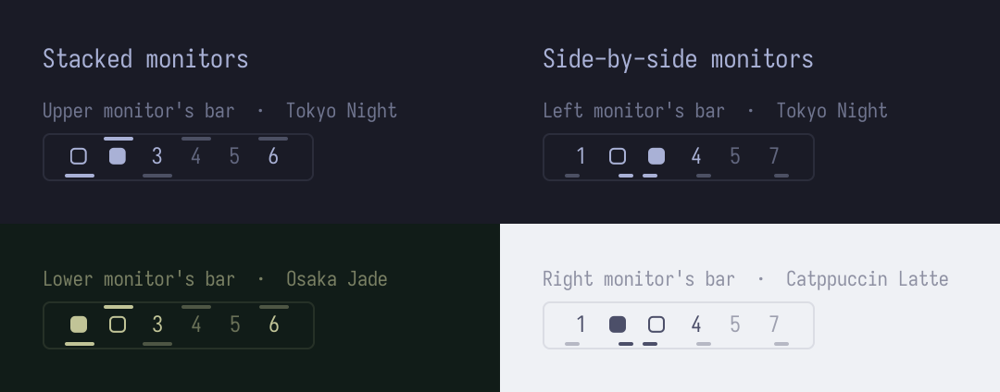

# Workspaces for Multiple Displays

A monitor-aware replacement for Omarchy's workspace bar widget.

The stock widget draws the same thing on every monitor's bar: it marks
whichever workspace has focus, so both bars jump together as focus moves, and
nothing shows which monitor a workspace lives on. This widget keeps the stock
numbering, keybindings, and click behaviour, and adds:

- **Each bar marks its own monitor's workspace.** The filled square (󱓻) sits on
  the workspace shown on the monitor that bar belongs to, whether or not that
  monitor has focus.
- **Workspaces showing on other monitors are marked too.** They get an outlined
  square (󱓼).
- **Every workspace shows which monitor it's on.** A thin line in the bar's text
  colour sits on the edge of the workspace number that matches where its monitor
  is. The line is full strength when the workspace is currently visible and
  dimmed otherwise.
- **Tooltips** name the monitor and its position, for example
  `Workspace 10 · DP-2 (top)`.



## How the lines map to monitors

Each workspace cell acts as a tiny map of your monitor layout. Lines always sit
on the long edges of a cell, the ones that run along the bar, so they never fall
between two neighbouring numbers.

| Monitor layout | Line on a top or bottom bar |
|---|---|
| Stacked | Full-width line on the top edge for the upper monitor, bottom edge for the lower one |
| Side by side | Half-width line on the left or right half for the left or right monitor |
| 2×2 or diagonal | Half-width line in the matching corner |
| One monitor, or mirrored outputs | No lines |

On a left or right bar the axes swap. Side-by-side monitors get a full line on
the left or right edge, and stacked monitors get the upper or lower half.

Workspaces 1–5 are always listed. A workspace that Hyprland doesn't currently
know about (empty and not persistent) has no monitor, so it gets no line.

Every bar shows the same lines. Only the filled and outlined squares differ
between bars.

## Known limitations

- A workspace shown on a monitor is drawn as a square instead of its number.
  With three or more monitors, several numbers are replaced at once; the
  tooltip still names each one.
- Only workspaces 1–10 are shown, as in the stock widget.

## Requirements

- Omarchy 4 with the Quickshell-based bar (`omarchy-shell`).
- Hyprland.
- A Nerd Font for the bar, which is the Omarchy default.

The plugin has no other dependencies. It installs no packages, services, or
hooks, runs no commands of its own besides the stock `hyprctl` focus dispatch
on click, and doesn't change your Hyprland configuration.

## Install

> [!WARNING]
> Omarchy plugins run as unsandboxed code inside `omarchy-shell`. Review the
> source before enabling it.

Add the plugin, put it on the bar next to the stock widget, then turn the stock
widget off:

```bash
omarchy plugin add https://github.com/tbradshaw/omarchy-workspaces-multidisplay.git
omarchy plugin enable io.github.tbradshaw.workspaces-multidisplay --after omarchy.workspaces
omarchy plugin disable omarchy.workspaces
```

When `omarchy plugin add` asks whether to enable the plugin, answer no; the
second command enables it in the right place.

## Configure

Move the widget like any other bar widget, for example:

```bash
omarchy bar move io.github.tbradshaw.workspaces-multidisplay --section center
```

## Update

```bash
omarchy plugin update io.github.tbradshaw.workspaces-multidisplay
```

## Go back to the stock widget

Turn the stock widget back on next to this one, then turn this one off:

```bash
omarchy plugin enable omarchy.workspaces --after io.github.tbradshaw.workspaces-multidisplay
omarchy plugin disable io.github.tbradshaw.workspaces-multidisplay
```

To uninstall completely:

```bash
omarchy plugin remove io.github.tbradshaw.workspaces-multidisplay
```

## Development

The widget is `Workspaces.qml`. The mapping from monitor geometry to line
placement lives in `MonitorLayout.js`, a plain QML JavaScript library, so it can
be tested without the shell.

Run the static checks. They validate the manifest, lint the QML against the
installed Omarchy shell, and run the layout tests with Node. None of them load
the plugin into the running shell.

```bash
./tests/check.sh
```

To try a working copy, copy the files into the plugin directory and enable the
plugin:

```bash
dest=~/.config/omarchy/plugins/io.github.tbradshaw.workspaces-multidisplay
mkdir -p "$dest"
cp manifest.json Workspaces.qml MonitorLayout.js "$dest/"
omarchy-shell shell rescanPlugins
omarchy plugin enable io.github.tbradshaw.workspaces-multidisplay
```

The shell reloads plugins whenever a file under `~/.config/omarchy/plugins/`
changes. Copying files in one step, rather than symlinking the plugin
directory to a working copy, keeps half-finished edits off your bar.

The first commit in this repository is an unmodified copy of Omarchy 4.0.4's
`omarchy.workspaces` widget, so `git diff` against it shows every change from
stock.

## Credits

The per-monitor active workspace and the `moveworkspacev2` refresh follow
[omacom/omarchy#11976](https://github.com/omacom/omarchy/pull/11976) and
[omacom/omarchy#10190](https://github.com/omacom/omarchy/pull/10190).

## License

[MIT](LICENSE). `Workspaces.qml` is derived from Omarchy's
`omarchy.workspaces` widget, copyright David Heinemeier Hansson, also under the
MIT License.
