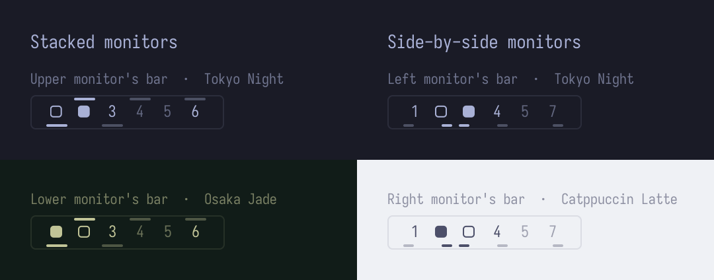

# Workspaces for Multiple Displays

A monitor-aware replacement for Omarchy's workspace bar widget.

The stock widget draws the same thing on every monitor's bar: it marks
whichever workspace has focus, so both bars jump together as focus moves, and
nothing shows which monitor a workspace lives on. This widget keeps the stock
numbering, keybindings, and click behaviour, and adds:

- **Each bar marks its own monitor's workspace.** The filled square (󱓻) sits on
  the workspace shown on the monitor that bar belongs to, whether or not that
  monitor has focus.
- **Workspaces showing on other monitors are marked too.** They get an outlined
  square (󱓼).
- **Every workspace shows which monitor it's on.** A thin line in the bar's text
  colour sits on the edge of the workspace number that matches where its monitor
  is. The line is full strength when the workspace is currently visible and
  dimmed otherwise.
- **Tooltips** name the monitor and its position, for example
  `Workspace 10 · DP-2 (top)`.
- **Optional icons and names for individual workspaces**, for workspaces you
  keep for one purpose. See [Workspace icons and names](#workspace-icons-and-names).
- **Right-click a workspace to send it to the next monitor**, in Hyprland's
  monitor order, wrapping back to the first. A workspace that is showing keeps
  showing on its new monitor and takes focus with it; a hidden one stays
  hidden. The monitor it leaves switches to another of its workspaces.
  Right-clicking a workspace that doesn't exist yet does nothing.



## How the lines map to monitors

Each workspace cell acts as a tiny map of your monitor layout. Lines always sit
on the long edges of a cell, the ones that run along the bar, so they never fall
between two neighbouring numbers.

| Monitor layout | Line on a top or bottom bar |
|---|---|
| Stacked | Full-width line on the top edge for the upper monitor, bottom edge for the lower one |
| Side by side | Half-width line on the left or right half for the left or right monitor |
| 2×2 or diagonal | Half-width line in the matching corner |
| One monitor, or mirrored outputs | No lines |

On a left or right bar the axes swap. Side-by-side monitors get a full line on
the left or right edge, and stacked monitors get the upper or lower half.

Workspaces 1–5 are always listed, as are any set to `alwaysShow`. A workspace
that Hyprland doesn't currently know about (empty and not persistent) has no
monitor, so it gets no line.

Every bar shows the same lines. Only the filled and outlined markers differ
between bars.

## Known limitations

- A workspace shown on a monitor is drawn as a square instead of its number,
  unless it has its own icon. With three or more monitors, several numbers are
  replaced at once; the tooltip still names each one.
- Only workspaces 1–10 are shown, as in the stock widget.

## Requirements

- Omarchy 4 with the Quickshell-based bar (`omarchy-shell`).
- Hyprland.
- A Nerd Font for the bar, which is the Omarchy default.

The plugin has no other dependencies. It installs no packages, services, or
hooks, runs no commands of its own besides `hyprctl` dispatches to focus a
workspace on click and move it to another monitor on right-click, and doesn't
change your Hyprland configuration.

## Install

> [!WARNING]
> Omarchy plugins run as unsandboxed code inside `omarchy-shell`. Review the
> source before enabling it.

Add the plugin, put it on the bar next to the stock widget, then turn the stock
widget off:

```bash
omarchy plugin add https://github.com/tbradshaw/omarchy-workspaces-multidisplay.git
omarchy plugin enable io.github.tbradshaw.workspaces-multidisplay --after omarchy.workspaces
omarchy plugin disable omarchy.workspaces
```

When `omarchy plugin add` asks whether to enable the plugin, answer no; the
second command enables it in the right place.

## Configure

Move the widget like any other bar widget, for example:

```bash
omarchy bar move io.github.tbradshaw.workspaces-multidisplay --section center
```

### Workspace icons and names

The `workspaces` setting gives individual workspaces their own look. It is
keyed by workspace number, from `1` to `10`, and each entry can set:

| Field | Default | Effect |
|---|---|---|
| `icon` | none | Drawn instead of the number. Any text works: a Nerd Font icon, an emoji, a letter. |
| `name` | none | Added to the tooltip, for example `Workspace 9 · Automation · DP-2 (top)`. |
| `alwaysShow` | `false` | List the workspace even while it's empty, as workspaces 1–5 always are. |

For example, to give workspace 9 a robot and workspace 10 the Battlestation
icon, and keep both on the bar:

```bash
omarchy bar set io.github.tbradshaw.workspaces-multidisplay workspaces \
  '{"9":{"icon":"󰚩","name":"Automation","alwaysShow":true},"10":{"icon":"󰣙","name":"Battlestation","alwaysShow":true}}' --json
```

A workspace with an icon keeps showing it while it's on screen. A filled pill
behind the icon marks it as the workspace shown on that bar's monitor, and an
outlined pill marks it as shown on another monitor. The monitor line works as
for any other workspace.

Keybindings and workspace numbers don't change, so `Super+9` and `Super+0`
still switch to workspaces 9 and 10. Nerd Font icons follow the bar's theme
colour. Emoji keep their own colours.

Each `omarchy bar set` replaces the whole `workspaces` value. To change one
workspace, pass the full set again, or edit the widget's entry in
`~/.config/omarchy/shell.json`.

## Update

```bash
omarchy plugin update io.github.tbradshaw.workspaces-multidisplay
```

## Go back to the stock widget

Turn the stock widget back on next to this one, then turn this one off:

```bash
omarchy plugin enable omarchy.workspaces --after io.github.tbradshaw.workspaces-multidisplay
omarchy plugin disable io.github.tbradshaw.workspaces-multidisplay
```

To uninstall completely:

```bash
omarchy plugin remove io.github.tbradshaw.workspaces-multidisplay
```

## Development

The widget is `Workspaces.qml`. The mapping from monitor geometry to line
placement lives in `MonitorLayout.js`, and reading the `workspaces` setting
lives in `WorkspaceOverrides.js`. Both are plain QML JavaScript libraries, so
they can be tested without the shell.

Run the static checks. They validate the manifest, lint the QML against the
installed Omarchy shell, and run the library tests with Node. None of them load
the plugin into the running shell.

```bash
./tests/check.sh
```

To try a working copy, copy the files into the plugin directory and enable the
plugin:

```bash
dest=~/.config/omarchy/plugins/io.github.tbradshaw.workspaces-multidisplay
mkdir -p "$dest"
cp manifest.json Workspaces.qml MonitorLayout.js WorkspaceOverrides.js "$dest/"
omarchy-shell shell rescanPlugins
omarchy plugin enable io.github.tbradshaw.workspaces-multidisplay
```

The shell rebuilds the widget whenever a file under
`~/.config/omarchy/plugins/` changes, but it keeps using the QML and
JavaScript it has already compiled. After copying changed code, run
`omarchy restart shell` to load it. Copying files in one step, rather than
symlinking the plugin directory to a working copy, keeps half-finished edits
off your bar.

The first commit in this repository is an unmodified copy of Omarchy 4.0.4's
`omarchy.workspaces` widget, so `git diff` against it shows every change from
stock.

## Credits

The per-monitor active workspace and the `moveworkspacev2` refresh follow
[omacom/omarchy#11976](https://github.com/omacom/omarchy/pull/11976) and
[omacom/omarchy#10190](https://github.com/omacom/omarchy/pull/10190).

## License

[MIT](LICENSE). `Workspaces.qml` is derived from Omarchy's
`omarchy.workspaces` widget, copyright David Heinemeier Hansson, also under the
MIT License.
